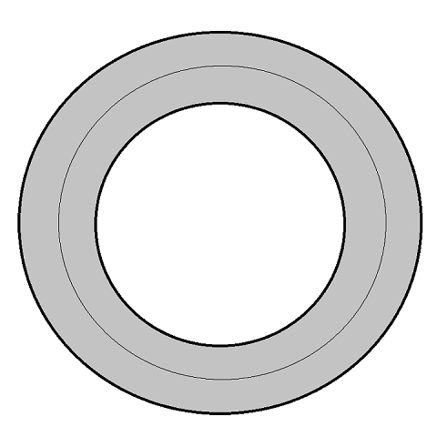

[](https://juejin.im/post/58fb4c64ac502e0063a2721e)

在 Android 的画布 Canvas 里面有个 drawBitmapMesh 方法，通过它可以实现对 Bitmap 的各种扭曲。我们试一下用它把图像扭出水波纹的效果。

和 Material Design 里扁平化的水波纹不同，这里是通过对图像的处理，模拟真实的水波纹效果，最后实现的效果如下：


# drawBitmapMesh 简介

我们先了解一下「网格」的概念。

将一个图片横向、纵向均匀切割成 n 份，就会形成一个「网格」，我把所有网格线的交点称为「顶点」。

正常情况下，顶点是均匀分布的。当我们改变了顶点的位置时，系统会拿偏移后的顶点坐标，和原来的坐标进行对比，通过一套算法，将图片进行扭曲，像这样：


接下来看看 drawBitmapMesh 方法：

```java
public void drawBitmapMesh(Bitmap bitmap,
                           int meshWidth,
                           int meshHeight,
                           float[] verts,
                           int vertOffset,
                           int[] colors,
                           int colorOffset,
                           Paint paint)
```

它的参数如下：

* bitmap - 需要转换的位图
* meshWidth - 横向的格数，需大于 0
* meshHeight - 纵向的格数，需大于 0
* verts - 网格顶点坐标数组，记录扭曲后图片各顶点的坐标，数组大小为 (meshWidth+1) * (meshHeight+1) * 2 + vertOffset
* vertOffset - 从第几个顶点开始对位图进行扭曲，通常传 0
* colors - 设置网格顶点的颜色，该颜色会和位图对应像素的颜色叠加，数组大小为 (meshWidth+1) * (meshHeight+1) + colorOffset，可以传 null
* colorOffset - 从第几个顶点开始转换颜色，通常传 0
* paint - 「画笔」，可以传 null

需要说明一下的是，可以用 colors 这个参数来实现阴影的效果，但在 API 18 以下开启了硬件加速，colors 这个参数是不起作用的。我们这里只关注前面四个参数，后面四个传 0、null、0、null 就可以了。

# 创建 RippleLayout

创建自定义控件 RippleLayout，为了让控件用起来更灵活，我让它继承了 FrameLayout（套上哪个哪个浪！）。

定义了如下成员变量：

```java
//图片横向、纵向的格数
private final int MESH_WIDTH = 20;
private final int MESH_HEIGHT = 20;
//图片的顶点数
private final int VERTS_COUNT = (MESH_WIDTH + 1) * (MESH_HEIGHT + 1);
//原坐标数组
private final float[] staticVerts = new float[VERTS_COUNT * 2];
//转换后的坐标数组
private final float[] targetVerts = new float[VERTS_COUNT * 2];
//当前控件的图片
private Bitmap bitmap;
//水波宽度的一半
private float rippleWidth = 100f;
//水波扩散速度
private float rippleSpeed = 15f;
//水波半径
private float rippleRadius;
//水波动画是否执行中
private boolean isRippling;
```

看注释就知道什么意思啦，下面会用到的。

然后又定义了一个这里会经常用到的方法，根据宽高计算对角线的距离（勾股定理）：

```java
/**
 * 根据宽高，获取对角线距离
 *
 * @param width  宽
 * @param height 高
 * @return 距离
 */
private float getLength(float width, float height) {
    return (float) Math.sqrt(width * width + height * height);
}
```

# 获取 Bitmap

要处理 Bitmap，第一步当然是先拿到 Bitmap，拿到后就可以根据 Bitmap 的宽高初始化两个顶点坐标数组：

```java
/**
 * 初始化 Bitmap 及对应数组
 */
private void initData() {
    bitmap = getCacheBitmapFromView(this);
    if (bitmap == null) {
        return;
    }
    float bitmapWidth = bitmap.getWidth();
    float bitmapHeight = bitmap.getHeight();
    int index = 0;
    for (int height = 0; height <= MESH_HEIGHT; height++) {
        float y = bitmapHeight * height / MESH_HEIGHT;
        for (int width = 0; width <= MESH_WIDTH; width++) {
            float x = bitmapWidth * width / MESH_WIDTH;
            staticVerts[index * 2] = targetVerts[index * 2] = x;
            staticVerts[index * 2 + 1] = targetVerts[index * 2 + 1] = y;
            index += 1;
        }
    }
}

/**
 * 获取 View 的缓存视图
 *
 * @param view 对应的View
 * @return 对应View的缓存视图
 */
private Bitmap getCacheBitmapFromView(View view) {
    view.setDrawingCacheEnabled(true);
    view.buildDrawingCache(true);
    final Bitmap drawingCache = view.getDrawingCache();
    Bitmap bitmap;
    if (drawingCache != null) {
        bitmap = Bitmap.createBitmap(drawingCache);
        view.setDrawingCacheEnabled(false);
    } else {
        bitmap = null;
    }
    return bitmap;
}
```

# 计算偏移坐标

接下来是重点了。这里要实现的水波的位置在下图的灰色区域：



我定义了一个 warp 方法，根据手指按下的坐标（原点）来重绘 Bitmap：

```java
/**
 * 图片转换
 *
 * @param originX 原点 x 坐标
 * @param originY 原点 y 坐标
 */
private void warp(float originX, float originY) {
    for (int i = 0; i < VERTS_COUNT * 2; i += 2) {
        float staticX = staticVerts[i];
        float staticY = staticVerts[i + 1];
        float length = getLength(staticX - originX, staticY - originY);
        if (length > rippleRadius - rippleWidth && length < rippleRadius + rippleWidth) {
            PointF point = getRipplePoint(originX, originY, staticX, staticY);
            targetVerts[i] = point.x;
            targetVerts[i + 1] = point.y;
        } else {
            //复原
            targetVerts[i] = staticVerts[i];
            targetVerts[i + 1] = staticVerts[i + 1];
        }
    }
    invalidate();
}
```

方法里面遍历了所有的顶点，如果顶点是在水波范围内，则需要对这个顶点进行偏移。

偏移后的坐标计算，思路大概是这样的：

为了让水波有突起的感觉，以水波中间（波峰）为分界线，里面的顶点往里偏移，外面的顶点往外偏移：


至于偏移的距离，我想要实现类似放大镜的效果，离波峰越近的顶点，偏移的距离会越大。离波峰的距离和偏移距离的关系，可以看作一个余弦曲线：


我们来看一下 getRipplePoint 方法，传入的参数是原点的坐标及需要转换的顶点坐标，在它里面做了下面这些处理：

1. 通过反正切函数获取到顶点和原点间的水平角度：


```java
float angle = (float) Math.atan(Math.abs((staticY - originY) / (staticX - originX)));
```

2. 通过余弦函数计算顶点的偏移距离：

```java
float length = getLength(staticX - originX, staticY - originY);
float rate = (length - rippleRadius) / rippleWidth;
float offset = (float) Math.cos(rate) * 10f;
```

这里的 10f 是最大偏移距离。

3. 计算出来的偏移距离是直线距离，还需要根据顶点和原点的角度，用余弦、正弦函数将它转换成水平、竖直方向的偏移距离：

```java
float offsetX = offset * (float) Math.cos(angle);
float offsetY = offset * (float) Math.sin(angle);
```

4. 根据顶点原来的坐标和偏移量就可以得出偏移后的坐标了，至于是加还是减，还要看顶点所在的位置。

getRipplePoint 的完整代码如下：

```java
/**
 * 获取水波的偏移坐标
 *
 * @param originX 原点 x 坐标
 * @param originY 原点 y 坐标
 * @param staticX 待偏移顶点的原 x 坐标
 * @param staticY 待偏移顶点的原 y 坐标
 * @return 偏移后坐标
 */
private PointF getRipplePoint(float originX, float originY, float staticX, float staticY) {
    float length = getLength(staticX - originX, staticY - originY);
    //偏移点与原点间的角度
    float angle = (float) Math.atan(Math.abs((staticY - originY) / (staticX - originX)));
    //计算偏移距离
    float rate = (length - rippleRadius) / rippleWidth;
    float offset = (float) Math.cos(rate) * 10f;
    float offsetX = offset * (float) Math.cos(angle);
    float offsetY = offset * (float) Math.sin(angle);
    //计算偏移后的坐标
    float targetX;
    float targetY;
    if (length < rippleRadius + rippleWidth && length > rippleRadius) {
        //波峰外的偏移坐标
        if (staticX > originY) {
            targetX = staticX + offsetX;
        } else {
            targetX = staticX - offsetX;
        }
        if (staticY > originY) {
            targetY = staticY + offsetY;
        } else {
            targetY = staticY - offsetY;
        }
    } else {
        //波峰内的偏移坐标
        if (staticX > originY) {
            targetX = staticX - offsetX;
        } else {
            targetX = staticX + offsetX;
        }
        if (staticY > originY) {
            targetY = staticY - offsetY;
        } else {
            targetY = staticY + offsetY;
        }
    }
    return new PointF(targetX, targetY);
}
```

我也不知道这种计算方法是否符合物理规律，反正感觉像那么回事。

# 执行水波动画

大家都知道事件分发机制，作为一个 ViewGroup，会先执行 dispatchTouchEvent 方法。我在事件分发之前执行水波动画，也保证了事件传递不受影响：

```java
@Override
public boolean dispatchTouchEvent(MotionEvent ev) {
    switch (ev.getAction()) {
        case MotionEvent.ACTION_DOWN:
            showRipple(ev.getX(), ev.getY());
            break;
    }
    return super.dispatchTouchEvent(ev);
}
```

showRipple 的任务就是循环执行 warp 方法，并且不断改变水波半径，达到向外扩散的效果：

```java
/**
 * 显示水波动画
 *
 * @param originX 原点 x 坐标
 * @param originY 原点 y 坐标
 */
public void showRipple(final float originX, final float originY) {
    if (isRippling) {
        return;
    }
    initData();
    if (bitmap == null) {
        return;
    }
    isRippling = true;
    //循环次数，通过控件对角线距离计算，确保水波纹完全消失
    int viewLength = (int) getLength(bitmap.getWidth(), bitmap.getHeight());
    final int count = (int) ((viewLength + rippleWidth) / rippleSpeed);
    Observable.interval(0, 10, TimeUnit.MILLISECONDS)
            .subscribeOn(Schedulers.io())
            .observeOn(AndroidSchedulers.mainThread())
            .take(count + 1)
            .subscribe(new Consumer<Long>() {
                @Override
                public void accept(@NonNull Long aLong) throws Exception {
                    rippleRadius = aLong * rippleSpeed;
                    warp(originX, originY);
                    if (aLong == count) {
                        isRippling = false;
                    }
                }
            });
}
```

这里用了 RxJava 2 实现循环，循环的次数是根据控件的对角线计算的，保证水波会完全消失。水波消失后再点击才会执行下一次的水波动画。

注意！要点题了。

讲了这么多还没用到 drawBitmapMesh 方法。ViewGroup 绘制子控件的方法是 dispatchDraw，warp 方法最后调用的 invalidate() 也会触发 dispatchDraw 的执行，所以可以在这里做手脚：

```java
@Override
protected void dispatchDraw(Canvas canvas) {
    if (isRippling && bitmap != null) {
        canvas.drawBitmapMesh(bitmap, MESH_WIDTH, MESH_HEIGHT, targetVerts, 0, null, 0, null);
    } else {
        super.dispatchDraw(canvas);
    }
}
```

如果是自定义 View 的话，要修改 onDraw 方法。

到这就完成啦。妥妥的。

对了，不建议用这个控件包裹可滑动或者有动画的控件，因为在绘制水波的时候，子控件的变化都是看不到的。

[源码地址](https://github.com/SouthernBox/RippleLayout)